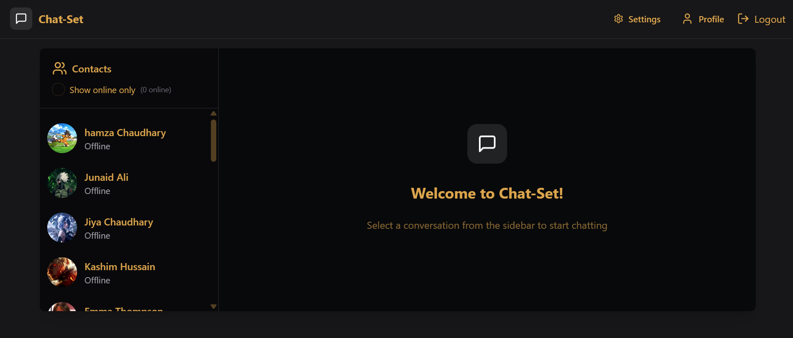
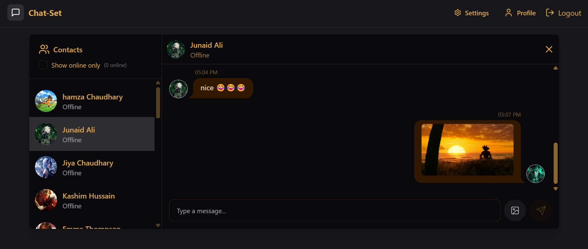

# Chat-Set 🚀

A modern, real-time chat application designed for seamless and secure communication. Built with cutting-edge technologies, this app allows users to chat in real-time, share images, update profiles, and customize their experience.

---

## ✨ Features

- **Real-Time Messaging**: Instant messaging with Socket.io for live updates.
- **User Authentication**: Secure login and registration using JWT (JSON Web Tokens).
- **Online/Offline Status**: See which users are online or offline in real-time.
- **Image Sharing**: Upload and share images seamlessly using Cloudinary.
- **Profile Customization**: Update your profile picture.
- **Theme Customization**: Switch between light and dark themes for a personalized experience.
- **Responsive Design**: Works flawlessly on all devices (desktop, tablet, and mobile).
- **Scalable Architecture**: Built with modular and scalable code for future enhancements.

---

## 🛠️ Tech Stack

### **Frontend**
- **Framework**: React.js
- **Styling**: TailwindCSS + DaisyUI (for beautiful, pre-built components)
- **State Management**: Zustand (lightweight and efficient state management)
- **Real-Time Communication**: Socket.io client
- **Image Handling**: Cloudinary integration for image uploads

### **Backend**
- **Framework**: Node.js with Express.js
- **Database**: MongoDB (with Mongoose for schema modeling)
- **Authentication**: JWT (JSON Web Tokens) for secure user sessions
- **Real-Time Communication**: Socket.io
- **Image Storage**: Cloudinary (for storing and managing user-uploaded images)

---

## 🚀 Getting Started

### Prerequisites
- Node.js (v16 or higher)
- MongoDB (installed and running)

### Installation

1. **Clone the repository**:
   ```sh
   git clone https://github.com/AB-Code-Hub/Chat-set.git
   ```

2. **Install frontend dependencies**:
   ```sh
   cd chat-app/frontend && npm install
   ```

3. **Install backend dependencies**:
   ```sh
   cd ../backend && npm install
   ```

### Running the Application

1. **Start MongoDB**:
   ```sh
   mongodb
   ```

2. **Start the backend server**:
   ```sh
   cd backend && npm start
   ```

3. **Start the frontend development server**:
   ```sh
   cd frontend && npm start
   ```

4. **Open the app**:
   - Visit `http://localhost:5173` in your browser.
   - Register or log in to start chatting!

---

## 🖼️ Screenshots 
 

 

---

## 🤝 Contributing

Contributions are welcome! Follow these steps to contribute:

1. **Fork the repository**.
2. **Create a new branch**:
   ```sh
   git checkout -b feature/YourFeatureName
   ```
3. **Commit your changes**:
   ```sh
   git commit -m 'Add some amazing feature'
   ```
4. **Push to the branch**:
   ```sh
   git push origin feature/YourFeatureName
   ```
5. **Open a Pull Request**.

---


## 🙏 Acknowledgments
- [Socket.io](https://socket.io) for real-time communication.
- [Cloudinary](https://cloudinary.com) for image storage and management.
- [TailwindCSS](https://tailwindcss.com) and [DaisyUI](https://daisyui.com) for styling.

---

